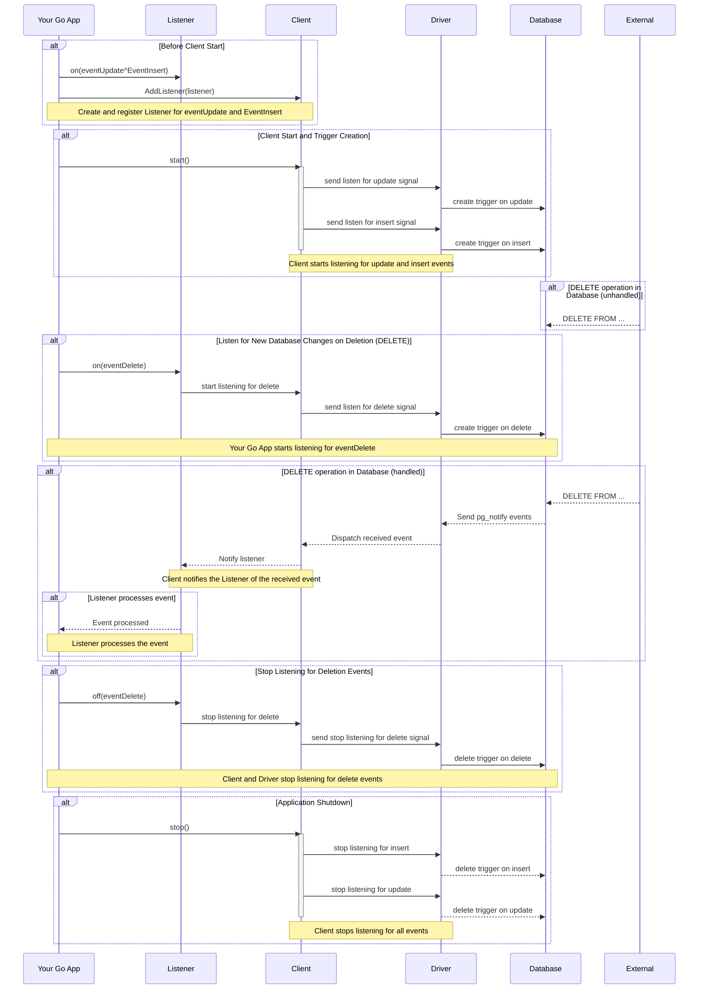

```mermaid
sequenceDiagram
    participant Your Go App
    participant Listener
    participant Client
    participant Driver
    participant Database
    participant External

    alt Before Client Start
        Your Go App->>Listener: on(eventUpdate^EventInsert)
        Your Go App->>Client: AddListener(listener)
        Note over Your Go App, Client: Create and register Listener for eventUpdate and EventInsert
    end

    alt Client Start and Trigger Creation
        Your Go App->>Client: start()
        activate Client
        Client->>Driver: send listen for update signal
        Driver->>Database: create trigger on update
        Client->>Driver: send listen for insert signal
        Driver->>Database: create trigger on insert
        deactivate Client
        Note over Client, Driver: Client starts listening for update and insert events
    end

    alt DELETE operation in Database (unhandled)
        External-->>Database: DELETE FROM ...
    end

    alt Listen for New Database Changes on Deletion (DELETE)
        Your Go App->>Listener: on(eventDelete)
        Listener->>Client: start listening for delete
        Client->>Driver: send listen for delete signal
        Driver->>Database: create trigger on delete
        Note over Your Go App, Database: Your Go App starts listening for eventDelete
    end

    alt DELETE operation in Database (handled)
        External-->>Database: DELETE FROM ...
        Database-->>Driver: Send pg_notify events
        Driver-->>Client: Dispatch received event
        Client-->>Listener: Notify listener
        Note over Client, Listener: Client notifies the Listener of the received event
        alt Listener processes event
            Listener-->>Your Go App: Event processed
            Note over Listener, Your Go App: Listener processes the event
        end
    end

    alt Stop Listening for Deletion Events
        Your Go App->>Listener: off(eventDelete)
        Listener->>Client: stop listening for delete
        Client->>Driver: send stop listening for delete signal
        Driver->>Database: delete trigger on delete
        Note over Your Go App, Database: Client and Driver stop listening for delete events
    end

    alt Application Shutdown
        Your Go App->>Client: stop()
        activate Client
        Client->>Driver: stop listening for insert
        Driver-->>Database: delete trigger on insert
        Client->>Driver: stop listening for update
        Driver-->>Database: delete trigger on update
        deactivate Client
        Note over Client, Driver: Client stops listening for all events
    end
```
