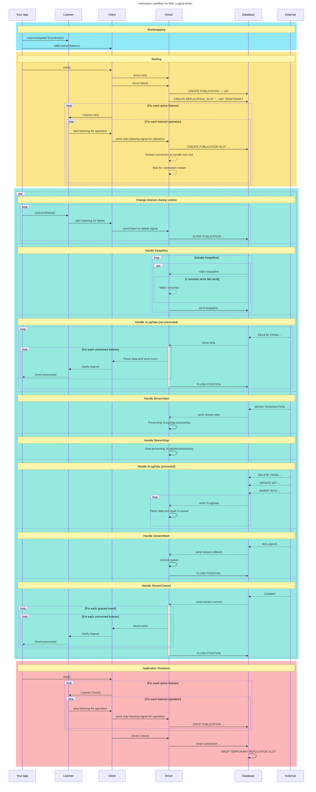

```mermaid
---
title: Interaction workflow for WAL Logical driver
---
sequenceDiagram
    participant Your App
    participant Listener
    participant Client
    participant Driver
    participant Database
    participant External
    rect rgba(34,211,238,0.5)
        note over Your App, External: Bootstrapping
        Your App ->> Listener: on(eventUpdate^EventInsert)
        Your App ->> Client: AddListener(listener)
    end
    rect rgba(250,204,21,0.5)
        note over Your App, External: Starting
        Your App ->> Client: start()
        Client ->> Driver: driver.Init()
        Client ->> Driver: driver.Start()
        Driver ->> Database: CREATE PUBLICATION "...-init"
        Driver ->> Database: CREATE REPLICATION_SLOT "...-slot" TEMPORARY
        loop For each active listener
            Client ->> Listener: Listener.Init()
            loop For each listened operation
                Listener ->> Client: start listening for operation
                Client ->> Driver: send start listening signal for operation
                Driver ->> Database: CREATE PUBLICATION SLOT ...
                Driver -->> Driver: Restart connection to handle new slot
                Driver -->> Driver: Wait for connection restart
            end
        end
    end
    rect rgba(45,212,191,0.5)
        par
            note over Your App, External: Change listeners during runtime
            loop
                Your App ->> Listener: on(eventDelete)
                Listener ->> Client: start listening for delete
                Client ->> Driver: send listen for delete signal
                Driver ->> Database: ALTER PUBLICATION ...
            end

        and
            note over Your App, External: Handle KeepAlive
            loop Handle KeepAlive
                par
                    Database --) Driver: claim keepalive
                and x seconds since last send
                    Driver -->> Driver: Wait x seconds
                end

                Driver ->> Database: send keepalive
            end
        and
            note over Your App, External: Handle XLogData (not prevented)
            loop
                External -->> Database: DELETE FROM ...
                Database --) Driver: Write WAL
                activate Driver
                loop For each concerned listener
                    Driver -->> Client: Parse data and send event
                    Client -->> Listener: Notify listener
                    Listener -->> Your App: Event processed
                end
                Driver ->> Database: FLUSH POSITION
                deactivate Driver
            end
        and
            note over Your App, External: Handle StreamStart
            External -->> Database: BEGIN TRANSACTION
            Database --) Driver: send stream start
            Driver ->> Driver: Preventing XLogData processing
        and
            note over Your App, External: Handle StreamStop
            Driver ->> Driver: Stop preventing XLogData processing
        and
            note over Your App, External: Handle XLogData (prevented)
            External -->> Database: DELETE FROM ...
            External -->> Database: UPDATE SET ...
            External -->> Database: INSERT INTO ...
            loop
                Database --) Driver: send XLogData
                Driver ->> Driver: Parse data and stack in queue
            end
        and
            note over Your App, External: Handle StreamAbort
            External -->> Database: ROLLBACK
            Database --) Driver: send stream rollback
            Driver ->> Driver: remove queue
            Driver ->> Database: FLUSH POSITION
        and
            note over Your App, External: Handle StreamCommit
            External -->> Database: COMMIT
            Database --) Driver: send stream commit
            activate Driver
            loop For each queued event
                loop For each concerned listener
                    Driver -->> Client: Send event
                    Client -->> Listener: Notify listener
                    Listener -->> Your App: Event processed
                end
            end
            Driver ->> Database: FLUSH POSITION
            deactivate Driver
        end
    end
    rect rgba(248,113,113,0.5)
        Note over Your App, External: Application Shutdown
        Your App ->> Client: stop()
        loop For each active listener
            Client ->> Listener: Listener.Close()
            loop For each listened operation
                Listener ->> Client: stop listening for operation
                Client ->> Driver: send stop listening signal for operation
                Driver ->> Database: DROP PUBLICATION ...
            end
        end
        Client ->> Driver: Driver.Close()
        Driver ->> Database: close connection ...
        Database ->> Database: DROP TEMPORARY REPLICATION SLOT
    end
```