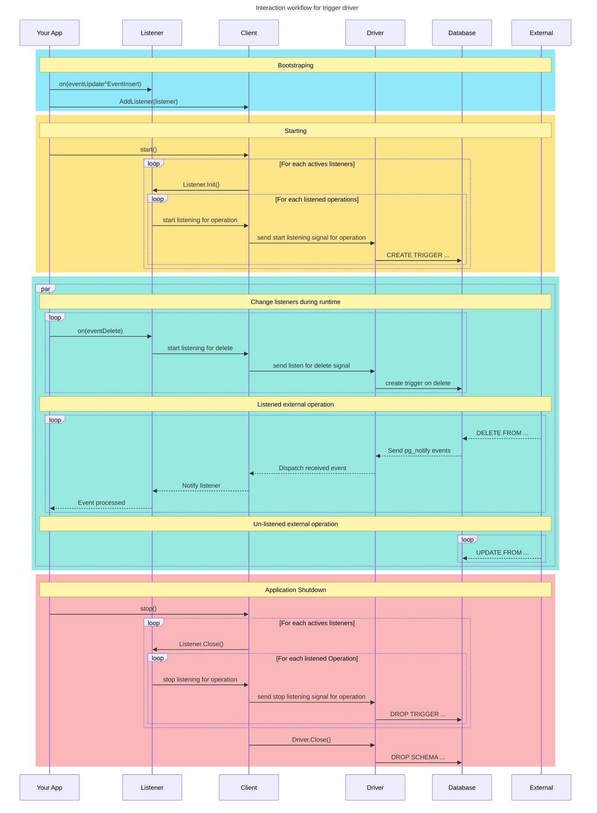

```mermaid
---
title: Interaction workflow for trigger driver
legend: TEST
---
sequenceDiagram
    participant Your App
    participant Listener
    participant Client
    participant Driver
    participant Database
    participant External
    rect rgba(34,211,238,0.5)
        note over Your App, External: Bootstraping
        Your App ->> Listener: on(eventUpdate^EventInsert)
        Your App ->> Client: AddListener(listener)
    end
    rect rgba(250,204,21,0.5)
        note over Your App, External: Starting
        Your App ->> Client: start()
        loop For each actives listeners
            Client ->> Listener: Listener.Init()
            loop For each listened operations
                Listener ->> Client: start listening for operation
                Client ->> Driver: send start listening signal for operation
                Driver ->> Database: CREATE TRIGGER ...
            end
        end
    end
    rect rgba(45,212,191,0.5)
        par
            note over Your App, External: Change listeners during runtime
            loop
                Your App ->> Listener: on(eventDelete)
                Listener ->> Client: start listening for delete
                Client ->> Driver: send listen for delete signal
                Driver ->> Database: create trigger on delete
            end
            note over Your App, External: Listened external operation
            loop
                External -->> Database: DELETE FROM ...
                Database -->> Driver: Send pg_notify events
                Driver -->> Client: Dispatch received event
                Client -->> Listener: Notify listener
                Listener -->> Your App: Event processed
            end
            note over Your App, External: Un-listened external operation
            loop
                External -->> Database: UPDATE FROM ...
            end
        end
    end
    rect rgba(248,113,113,0.5)
        Note over Your App, External: Application Shutdown
        Your App ->> Client: stop()
        loop For each actives listeners
            Client ->> Listener: Listener.Close()
            loop For each listened Operation
                Listener ->> Client: stop listening for operation
                Client ->> Driver: send stop listening signal for operation
                Driver ->> Database: DROP TRIGGER ...
            end
        end
        Client ->> Driver: Driver.Close()
        Driver ->> Database: DROP SCHEMA ...
    end
```